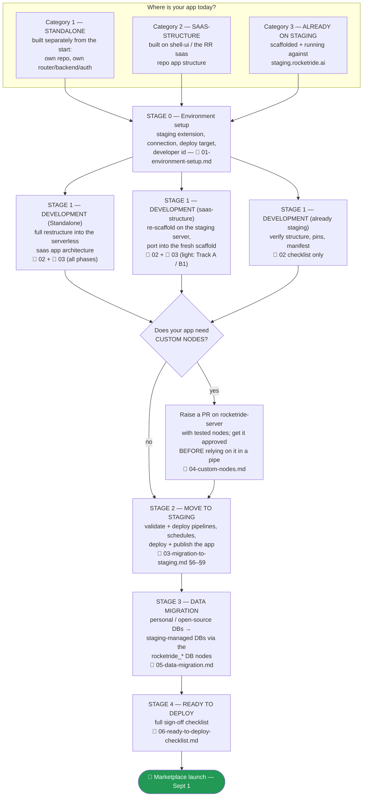

# RocketRide App Development & Staging Migration Guide

**Audience:** every RocketRide app owner preparing an app for the **App Marketplace launch on September 1, 2026**.
**Development deadline: TODAY (2026-08-27) at 6:00 PM.** Everything through Stage 1 (your app restructured into the RocketRide serverless app architecture and building clean) must be done by then. Stages 2–3 (staging + data migration) follow immediately after, so Sept 1 is deploy-ready.

This package is the single path. Whatever state your app is in, start here, find your category, and follow the docs in order. Do not skip steps — each one de-risks the next.

> **Prefer a printable summary?** [RocketRide-App-Migration-Overview.pdf](RocketRide-App-Migration-Overview.pdf) is the 2-page branded overview of this whole process (flowchart, stages, contacts, deadlines) — hand it to app owners; this package remains the step-by-step reference. (Editable source: `overview-source.html`, kept at the workspace root.)

> 🎟 **Free app-building tokens:** development and testing burn platform tokens. Redeem coupon code **`HACKANAPP`** on staging (shell sidebar footer → **Account → Billing** → redeem code) **before you start building** — it grants the tokens for your migration's pipeline runs. Trouble redeeming → Shashidhar.

---

## The pipeline (all apps, all categories)

Deadline mapping: **Stage 0 + Stage 1 (+ custom-node PRs raised) → today 6:00 PM** · Stages 2–3 → this week · Stage 4 sign-off → before Sept 1.

---

## Documentation map — where do I go?

| # | Document | Read when… |
|---|---|---|
| 00 | **INDEX** (this file) | Always first. Route yourself by category below. |
| 01 | [01-environment-setup.md](01-environment-setup.md) | **Everyone, before anything else.** Install the staging extension correctly, connect to staging, configure a deploy target, claim your org's developer id. |
| 02 | [02-app-structure.md](02-app-structure.md) | You need to know what the target "serverless" app architecture is, how apps are scaffolded (never hand-created), and how your current app maps onto it (Track A / B1 / B2). |
| 03 | [03-migration-to-staging.md](03-migration-to-staging.md) | The phase-by-phase migration: binding inventory → contract → scaffold → port → pipelines → schedules → deploy/publish → secrets. |
| 04 | [04-custom-nodes.md](04-custom-nodes.md) | Your pipelines need a node that doesn't exist in the staging catalog. PR process on `rocketride-server`. |
| 05 | [05-data-migration.md](05-data-migration.md) | Moving your data off personal / public open-source DBs onto the staging-managed graph / SQL / vector stores. |
| 06 | [06-ready-to-deploy-checklist.md](06-ready-to-deploy-checklist.md) | Final sign-off. An app is launch-ready when every box is checked. |

### Route by category

| Your app today | Your path |
|---|---|
| **Standalone** (own repo, own REST/WS backend, own auth, own router) | 01 → 02 (Track B2) → 03 all phases → 04 (if needed) → 05 → 06 |
| **saas-structure** (shell-ui / RR app structure, in-repo or an older RR workspace app) | 01 → 02 (Track A or B1) → 03 (translation table + re-scaffold, then §6 onward) → 04 (if needed) → 05 → 06 |
| **Already on staging** | 01 (verify only) → 02 checklist → 04 (if needed) → 05 → 06 |

---

## Source documents & authorship — this guide does NOT replace them

This package is a **router and process overlay**, not a rewrite. The platform's authored docs are canonical and stay exactly as their owners wrote them — this guide only tells you *when* to read each one. **Do not edit, fork, or restyle the source docs.** If this guide and a source doc disagree, the source doc wins — flag the conflict to Shashidhar.

| Source document | Author / owner | What it is (and when this guide sends you there) |
|---|---|---|
| `README-apps.md` | **Rod (Chief Architect)** | The canonical shell-ui app-building guide: manifest, AppDescriptor, shell props, hooks, Documents/VFS, MF build config. Doc 02 summarizes only the migration-relevant subset. |
| `README-app-styles.html` | **Design owner** (2026-07 UI consistency program) | The canonical visual guide: archetypes, stock component library, shell API reference, design decision log. All UI work is measured against it. |
| `README-release-process.md` | **Dmitrii** | How code reaches staging and production (develop → stage → main). Custom-node PRs (doc 04) ride this train. |
| `PLAN-staging-production.md` | **Dmitrii** (reviewed by Rod) | The staging/production infrastructure plan. |
| [APP-MIGRATION-PLAYBOOK.md](APP-MIGRATION-PLAYBOOK.md) + [MIGRATION.md](MIGRATION.md) | Migration team (Spaceport worked example) | The generic playbook and the executed worked example that doc 03 distills — local copies bundled with this package (MIGRATION.md originates from `apps/spaceport/docs/MIGRATION.md`). Read them for full depth. |
| `01-setup.md` / `02-how-it-works.md` / `03-findings.md` | Staging rollout test notes | The verified setup steps and findings doc 01 is built from. |
| `.rocketride/docs/ROCKETRIDE_*.md` | Platform (vendored from the connected server) | The 10-doc set every workspace receives — always reached via the `CLAUDE.md` router. |

## Who to contact

| Topic | Contact |
|---|---|
| Anything **app-builder related**: app structure, scaffold, shell API, migration phases, pipelines, custom-node process, this guide | **Shashidhar Babu** — shashidhar.babu@rocketride.ai |
| **Deployment & staging infrastructure**: staging environment health, server-side build failures, release train (Send to Stage / Deploy Everything), the staging→production plan | **Dmitrii** (owner of `PLAN-staging-production.md` and the release-process doc) |

Rule of thumb: if the problem is *in your app or your workspace*, ping Shashidhar. If the problem is *in the staging server or the deploy pipeline itself* (e.g. a build that dies server-side before your code even runs), ping Dmitrii.

---

## Ground rules (read once, they apply everywhere)

1. **Never hand-create app files.** New apps come only from the scaffold — `client.deploy.createApp(slug, …)` for agents/scripts, the App Builder's New App wizard for humans.
2. **pnpm, not npm.** `npm install` corrupts the workspace layout.
3. **Vendored packages only.** `rocketride` and `shell` always install from the workspace's own `.rocketride/client/rocketride.tgz` / `.rocketride/shell/shell.tgz` — never from the npm registry.
4. **Never invent API calls.** Verify every `client.*` method against the vendored client and your language's API doc; verify every pipeline component against `.rocketride/services-catalog.json` and `.rocketride/schema/`.
5. **Read the platform docs before writing RocketRide code.** `.rocketride/docs/ROCKETRIDE_README.md` first; its task router tells you what else to read.
6. **Dev pair vs deploy pair.** Lifecycle verbs (deploy / publish / schedule) run only against `ROCKETRIDE_DEPLOY_URI`/`ROCKETRIDE_DEPLOY_APIKEY`.
7. **No secrets in app bundles or `.pipe` files.** Secrets live in the server-side layered environment as `${ROCKETRIDE_*}` references.
